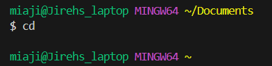

# `cd`
> ## 1. No Arguments

The first example is using the command `cd` with no arguments. When this is run, it will return the user to the home directory, which in this case takes the user back from Documents to home. This is because since the `cd` command lacks an argument, it cannot directed anywhere besides the home directory. This does not create an error.

> ## 2. A path to directory as an argument

The second example is using the command `cd` with a path to directory as an argument. When using a path to directory as an argument using the command `cd`, it will change the working directory to the desired directory. In this case, it is downloads. It can be seen that when we used `cd downloads` the working directory changed to Downloads as it is our desired working directory. This does not create an error.

> ## 3. A path to a file as an argument

The last example is using the command `cd` with a path to a file as an argument. Becaause lab1.txt is not a directory, an error is produced since `cd` can only change directories into a folder and not a file.

--------------------------------------------------------------------------------------------------------------------------------------------------------------------
# `ls`
> ## 1. No Arguments

The first example is using the command `ls` with no arguments. When no arguments are provided with `ls`, it will return the list of files in the current directory in alphabetical order. This is because there is no specific directory that it is being asked to list the files of, so instead it displays everything accessible to the user in the home directory. This does not create an error.

> ## 2. A path to directory as an argument

The second example is using the command `ls` with a path to directory as an argument. When this is run, it will show the user the contents of the directory that was called upon. In this example, it is being asked to list the files in links and displays it to the user. This is because the user is being more specific in referencing a directory using `ls` compared to using it with no arguments. This does not create an error.

> ## 3. A path to a file as an argument

The last example is using the command `ls` with a path to a file as an argument. When using `ls` on a path to a file as an argument, it listed the directory path to the fie itself. This does not produce an error.

--------------------------------------------------------------------------------------------------------------------------------------------------------------------
# `cat`
> ## 1. No Arguments

The first example is using the command `cat` with no arguments. When the 'cat' is used with no arguments, it reads the data from the input and composes it to the output. In the picture above, this is exemplified the program took the user input 'cse15l' and outputted 'cse15l' as well. This occurs because there is no argument used in the original `cat` command, so the input the user types becomes the standard input. This does not create an error.

> ## 2. A path to directory as an argument

The second example is using the command `cat` with a path to directory as an argument. In this example, the target directory is lab1 and to access it, we are passing in OneDrive/Desktop/lab1 since that is where the directory is located. This does not create an error.

> ## 3. A path to a file as an argument

The third example is using the command `cat` with a path to directory as an argument. The `cat` command was used to create a file called 'lab1.txt' containing the statement "Hello World!". A new path was then created from the home directory to 'lab1.txt' and this is because the argument was to make a new file under the home directory. This does not create an error.
